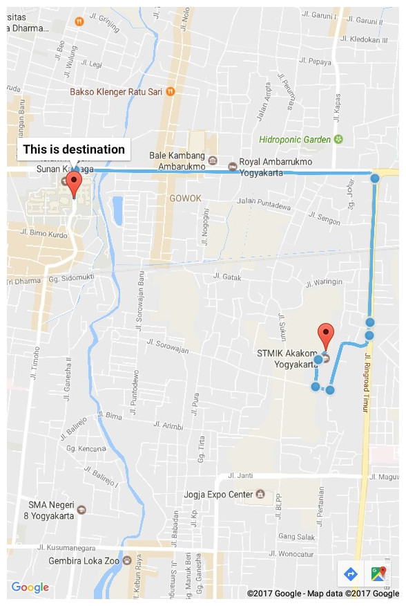
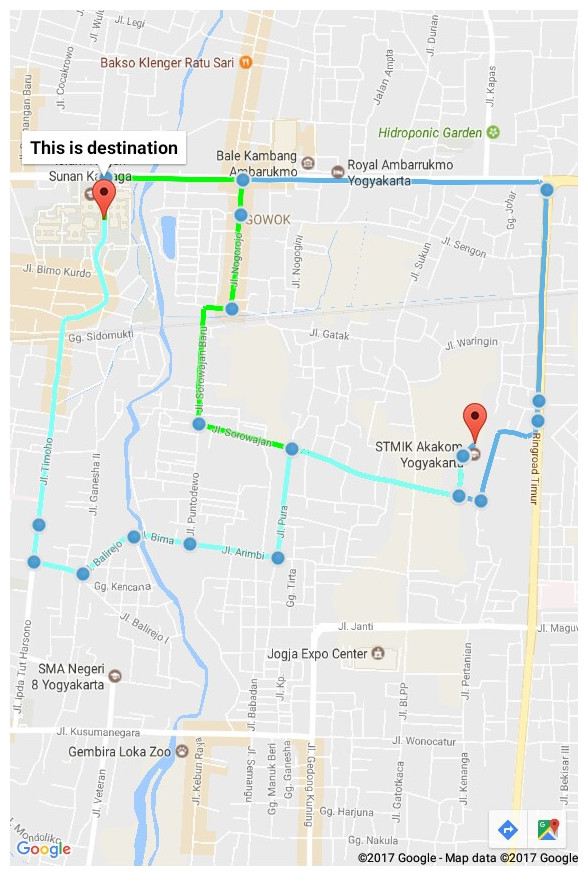
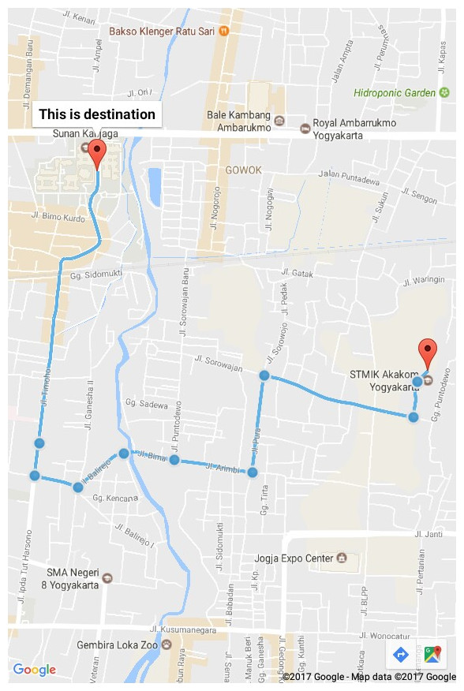

rute: Android Google Maps V2 implementation
===========================================

Simple library to use Android Google Maps V2. (Not all features implemented)

Requirements
------------

* [API-key](https://developers.google.com/maps/documentation/directions/get-api-key#key) in `AndroidManifest.xml`

```
<application ... >
    ...
    <meta-data
        android:name="com.google.android.geo.API_KEY"
        android:value="your-api-key" />
    ...
</application>
```

* [play-services](https://developers.google.com/android/guides/setup) in `build.gradle`

```
dependencies {
    ...
    compile 'com.google.android.gms:play-services:10.0.1'
}
```

* [koneksiurl](https://github.com/epanji/koneksiurl) in `build.gradle`

```
dependencies {
    ...
    compile 'com.gmail.epanji:koneksiurl:1.0.0'
}
```

Features
--------

* RouteAdapter
    * able to use your own icon
* RouteView
    * setOrigin()
    * setDestination()
    * setAdapter()
* RouteBuilder
    * addColor()
    * setWaypoints()

~~not finished yet~~

Installation
------------

You can use this library in your android studio project by add one of
the following `build.gradle` configuration:

~~not yet implemented~~

Usage
=====

~~not finished yet~~

Sample + Screenshots
====================

<br><br>

**MainActivity**

```java
public class MainActivity extends AppCompatActivity implements OnMapReadyCallback {

    private RouteView mRouteView;

    private Double mOriginLat = -7.792329;
    private Double mOriginLng = 110.407895;

    private Double mDestinationLat = -7.784654;
    private Double mDestinationLng = 110.395058;

    @Override
    protected void onCreate(Bundle savedInstanceState) {
        super.onCreate(savedInstanceState);
        setContentView(R.layout.activity_main);

        mRouteView = (RouteView) getSupportFragmentManager()
                .findFragmentById(R.id.rvMain1);
        mRouteView.getMapAsync(this);
    }

    @Override
    public void onMapReady(GoogleMap map) {
        try {
            List<Route> lr = new Sample().execute().get();
            if (!lr.isEmpty()) {
                mRouteView.setOrigin(new MarkerOptions()
                        .position(new LatLng(mOriginLat,mOriginLng))
                        .title("This is origin"));

                mRouteView.setDestination(new MarkerOptions()
                        .position(new LatLng(mDestinationLat,mDestinationLng))
                        .title("This is destination"));

                mRouteView.setAdapter(
                        new RouteAdapter(MainActivity.this, map, lr, R.mipmap.ic_launcher));
            }
        } catch (InterruptedException | ExecutionException ignored) {}
    }

//    choose AsyncTask to add here from bellow

}
```


<br><br>

**AsyncTask**

---

```java
    private class Sample extends AsyncTask<Void, Void, List<Route>> {
        @Override
        protected List<Route> doInBackground(Void... params) {
            String origin = mOriginLat + "," + mOriginLng;
            String destination = mDestinationLat + "," + mDestinationLng;

            RouteBuilder rb = new RouteBuilder(origin, destination);
            rb.addColor(0xFF63B3EA); // if not set, default color will be used.

            return rb.build();
        }
    }
```



<br><br>

```java
    private class Sample extends AsyncTask<Void, Void, List<Route>> {
        @Override
        protected List<Route> doInBackground(Void... params) {
            String origin = mOriginLat + "," + mOriginLng;
            String destination = mDestinationLat + "," + mDestinationLng;

            RouteBuilder rb = new RouteBuilder(origin, destination);
            rb.addColor(0xFF63B3EA);
            rb.addColor(Color.GREEN);
            rb.addColor(Color.parseColor("#85FFF7"));

            return rb.build();
        }
    }
```



<br><br>

```java
    private class Sample extends AsyncTask<Void, Void, List<Route>> {
        @Override
        protected List<Route> doInBackground(Void... params) {
            String origin = mOriginLat + "," + mOriginLng;
            String destination = mDestinationLat + "," + mDestinationLng;

            RouteBuilder rb = new RouteBuilder(origin, destination);
            rb.addColor(0xFF63B3EA);
            rb.addColor(Color.GREEN);
            rb.addColor(Color.parseColor("#85FFF7"));

//            add waypoints sometimes make results less than colors you add.
            String[] waypoints = {"-7.796239,110.401054", "-7.7963694,110.39262"};
            rb.setWaypoints(Arrays.asList(waypoints));

            return rb.build();
        }
    }
```



License
=======

Copyright (C) 2017  Panji Kusuma

Licensed under the Apache License, Version 2.0 (the "License");
you may not use this file except in compliance with the License.
You may obtain a copy of the License at

   http://www.apache.org/licenses/LICENSE-2.0

Unless required by applicable law or agreed to in writing, software
distributed under the License is distributed on an "AS IS" BASIS,
WITHOUT WARRANTIES OR CONDITIONS OF ANY KIND, either express or implied.
See the License for the specific language governing permissions and
limitations under the License.
